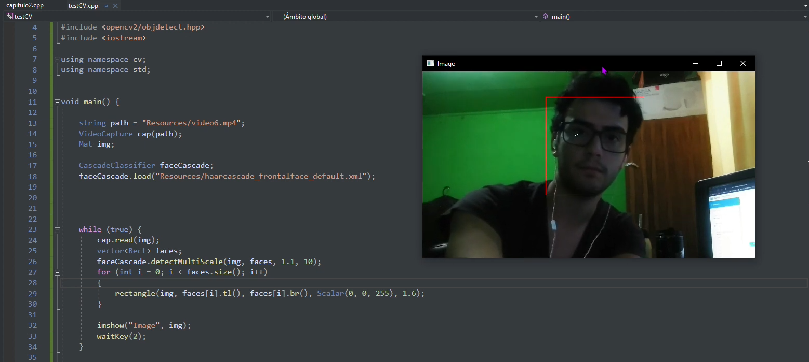

# Informe Técnico 
## Curso: Estructura de datos
### Detección y reidentificación de caras en secuencias de imágenes o video

**Alumnos:**

* Nicolas Bravo (Encargado de bitácora)
* Carlos Tapia (Coordinador)

## Resumen 

> Para este taller se realizará de software de vigilancia que funcionará a través de visión artificial, en el cual reconocerá rostros de personas por medio de una cámara de video o un video ya grabado, en el cual etiquetará con un código único a cada persona.
> El software tendrá varios apartados para facilitar la vigilancia, en el transcurso de la sesión se podrá ver las personas que más tiempo pasan en cámara y los rostros estarán destacados por un rectángulo de color. Al terminar la sesión o el día, el sistema tendrá en memoria las personas que más tiempo estuvieron en cámara.
> También arrojará una lista con las entidades y se podrá observar en que intervalo de tiempo esta aparece en el video.

## 1. Introducción

En el presente proyecto se propone implementar un sistema de vigilancia basado en el reconocimiento de caras. El proyecto busca calcular el tiempo que una persona aparece en la cámara, incluso si esta se pierde en la detección o no se encuentra en el cuadro por un tiempo determinado.
Para lograr esto se utilizará Visual Studio Community como IDE y las librerías de OpenCV.

El presente trabajo está dividido en 3 capítulos. El primer capítulo es la descripción del problema, los objetivos de este proyecto y su solución. En el segundo capítulo se hablará sobre cómo se desarrollará, como se implementará y que se utilizará en este proyecto. Y en el tercer capítulo se comentará sobre los resultados obtenidos del proyecto y se dará una conclusión.

### 1.1 Descripción del problema

El problema a resolver es crear un software de vigilancia capaz de reconocer rostros de personas y que, además sepa identificar a la persona que se encuentra en pantalla.

### 1.2 Objetivos 

**Objetivo General**

Implementar un sistema de detección de rostros que liste por persona la cantidad de tiempo que aparecieron dentro de un video.

**Objetivos específicos**

1.  Identificar rostros de personas que aparezcan en el video.
2.  Asignar una ID a cada persona identificada.
3.  Destacar rostros reconocidos por la librería mediante un cuadrado de color.
4.  Determinar cuánto tiempo aparece una persona determinada en el video.

### 1.3 Solución propuesta

Para este proyecto se utilizarán el modelo Haar Cascade , ya que por lo que hemos podido investigar este es uno de los detectores de rostros más utilizados y eficientes.

## 2. Materiales y métodos

### 2.1 Instalación

Para la realización de este proyecto se utilizarán las librerías de OpenCV (ver.4.3.5) y el IDE Visual Studio Comunnity 2019.

### 2.2 Diseño 


### 2.3 Implementación


#### Detector de caras

El modelo de detección de rostros que utilizaremos será Haar Cascade, funciona cargando el archivo de modelo en Haar Cascade y lo aplica a una imagen en escala de grises. el resultado es una lista que contiene las caras detectadas. Cada miembro de la lista es de nuevo una lista con 4 elementos que indican las coordenadas (x, y) de la esquina superior izquierda y el ancho y alto de la cara detectada.

```c++
	faceCascade.load("Resources/haarcascade_frontalface_default.xml");
	int id = 0;
	while (1) {
		cap.read(img);
		if (img.empty())  // si el frame esta vacio se rompe el bucle.
			break;
		vector<Rect> faces;
		faceCascade.detectMultiScale(img, faces, 1.1, 9);
		for (int i = 0; i < faces.size(); i++)
		{
			int x, y, w, h;
			x = faces[i].x;
			y = faces[i].y;
			w = faces[i].width;
			h = faces[i].height;
			Persona* persona = new Persona(x, y, w, h, id);
			listaPersonas->insertarPrimer(persona);
			Point tl(x, y);
			Point br((x + h), (y + w));
			rectangle(img, tl, br, Scalar(0, 0, 255), 1.5);
			id++;
		}
		imshow("Video", img);
		waitKey(2);
	}
```
En esta etapa del proyecto como se puede observar en el codigo las caras obtenidas por la libreria se descomponen en sus coordenadas de inicio superior izquierda y longitudes de la cara guardandolas en una LinkedList.

#### Implementacion del arbol binario

Para el proyecto se implemento un arbol binario para guardar los rostros detectados con sus respectivas id's y tiempos que aparecieron en pantalla

```c++
void ArbolBinario::Insertar(Persona* p) { //llega la persona con la imagen en grises
    if (raiz == nullptr) {
        Nodo* nn = new Nodo(p);
        nn->vista();
        nn->setId(ids);
        ids++;
        raiz = nn; // se asigna a raiz el nuevo nodo

    }
    else {
        Nodo* nodoAux = raiz;
        bool b = true;
        while (b) {
            if (diferente <= distanciaEuclideana(nodoAux->getPersona()->getImg(), p->getImg())) {
                if (nodoAux->getRight() == nullptr) { // si esta vacio se agrega
                    Nodo* nn = new Nodo(p);
                    nn->setId(ids);
                    ids++;
                    nn->vista();
                    nodoAux->setRight(nn);
                    b = false;
                }
                else {
                    nodoAux = nodoAux->getRight(); // sino se sigue bajando
                }
            }
            else if (similar < distanciaEuclideana(nodoAux->getPersona()->getImg(), p->getImg()) && diferente > distanciaEuclideana(nodoAux->getPersona()->getImg(), p->getImg())) {
                if (nodoAux->getLeft() == nullptr) {
                    Nodo* nn = new Nodo(p);
                    nn->setId(ids);
                    ids++;
                    nn->vista();
                    nodoAux->setLeft(nn);
                    b = false;
                }
                else {
                    nodoAux = nodoAux->getLeft();
                }
            }
            //este else es si la distancia e, es menor a la variable 'similar' (significa que es la misma cara).
            else {
                nodoAux->setPersona(p); // se remplaza la persona del nodo.
                nodoAux->vista(); // +1 veces  vista 
                b = false; //al remplazar la persona se corta el bucle
            }
        }
    }
}
```
Tambien se implemento el siguiente metodo para desplegar en la consola las id´s de los rostros detectados con sus respectivos tiempos de aparicion en pantalla

```c++
void ArbolBinario::show(Nodo* node) {
    if (node != NULL) {
        node->show();
        show(node->getLeft());
        show(node->getRight());
    }
}
void ArbolBinario::show() {
    show(raiz);
}
```



## 3. Resultados obtenido
Hasta ahora se ha implementado que cada cara detectada tenga un identificador , pero el principal problema es que cada frame que pasa en el video la cara la identifica como una nueva , por lo tanto a lo largo del video se identifican caras repetidas.

## 4. Conclusiones


# Anexos

## Anexo A: Instalación librerías OpenCV
Para la descarga de las librerías de OpenCv utilizamos la página oficial, y para la instalación utilizamos el video proporcionado por el profesor.
## Anexo B: Instalación de IDE y configuración librerías OpenCV

# Referencia

1. Fernando, S., 2021. Introduction. [online] Opencv-srf.com. Available at: <https://www.opencv-srf.com/p/introduction.html> [Accessed 10 October 2021].
